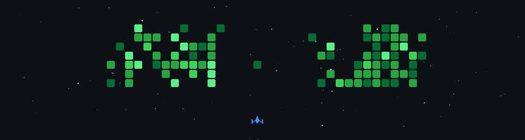

# Olá, Mundo! 👋 Eu sou Ryan Soares

**`💻 Full Stack Developer | Angular • TypeScript • Node.js`**

---

## 🚀 Sobre mim

Sou desenvolvedor Full Stack apaixonado por criar aplicações web modernas, escaláveis e com foco em performance.

Meu principal ecossistema é **TypeScript**, desenvolvendo interfaces com **Angular** e APIs utilizando **Node.js**. Gosto de criar soluções bem estruturadas, explorar novas tecnologias e entender como elas funcionam internamente, sempre buscando escrever código limpo, reutilizável e de fácil manutenção.

Atualmente, meus estudos e projetos estão voltados para arquitetura de software, otimização de aplicações, bancos de dados relacionais e NoSQL, testes automatizados e ambientes containerizados.

### 🎯 Áreas de interesse

- ⚡ Performance e otimização de aplicações Web
- 🧩 Arquitetura Front-end e componentização
- 🎨 Interfaces modernas e responsivas
- 🗄️ Bancos de dados SQL e NoSQL
- 🧪 Testes automatizados
- 🐳 Containers, infraestrutura e deploy

---

## 🛠️ Tecnologias e Ferramentas

&nbsp;&nbsp;

&nbsp;&nbsp;

&nbsp;&nbsp;

&nbsp;&nbsp;

&nbsp;&nbsp;

&nbsp;&nbsp;

&nbsp;&nbsp;

&nbsp;&nbsp;

&nbsp;&nbsp;

&nbsp;&nbsp;

&nbsp;&nbsp;

&nbsp;&nbsp;

&nbsp;&nbsp;

&nbsp;&nbsp;

&nbsp;&nbsp;

&nbsp;&nbsp;

---

## 📚 Atualmente estudando

- Angular
- NodeJS
- Bun
- GraphQL
- Redis
- MongoDB
- PostgreSQL
- Docker

---

## 📊 Estatísticas

  

&nbsp;&nbsp;

  

 

---

## 🌟 Projetos em Destaque

| Projeto | Descrição | Stack |
| :--- | :--- | :--- |
| **Playground** | Plataforma Full Stack para execução remota de código em ambientes isolados (sandboxes), permitindo testar diferentes linguagens de forma segura. | `Angular` • `Bun` • `Docker` • `Sass` |
| **Fiamma Pizza** | Aplicação web para uma pizzaria inspirada no estilo napolitano, desenvolvida com foco em experiência do usuário, catálogo digital e integração entre front-end e back-end. | `Angular` • `Tailwind CSS` • `Node.js` • `PostgreSQL` |
| **Video Streaming** | Plataforma de streaming desenvolvida para demonstrar autenticação, catálogo de mídia, organização de conteúdo e arquitetura Full Stack. | `Angular` • `Tailwind CSS` • `Node.js` • `MongoDB` |

---

## 📫 Vamos nos conectar?

---

*"Code is more than making things work — it's about building solutions that are clean, maintainable and enjoyable to evolve."*

